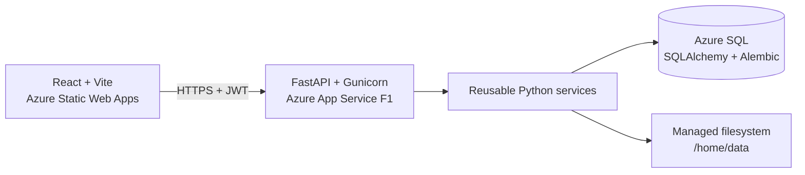

# Smart Workspace Manager

Smart Workspace Manager is a full-stack file and spreadsheet workspace built with React, FastAPI, SQLAlchemy, and Azure SQL. Users can create an account, manage their own files, analyze and clean CSV data, convert XLSX worksheets, create charts, and generate downloadable HTML/PDF reports.

The active Phase 2 application is deployed through GitHub Actions:

| Component | Deployment |
| --- | --- |
| React frontend | [Azure Static Web Apps](https://mango-tree-09402d200.1.azurestaticapps.net) |
| FastAPI backend | [Azure App Service](https://smart-workspace-manager-phase1-f5b9emgdcecsddeg.centralindia-01.azurewebsites.net) |
| Health check | [`/health`](https://smart-workspace-manager-phase1-f5b9emgdcecsddeg.centralindia-01.azurewebsites.net/health) |
| Interactive API docs | [`/docs`](https://smart-workspace-manager-phase1-f5b9emgdcecsddeg.centralindia-01.azurewebsites.net/docs) |
| Metadata database | Azure SQL Database |

The former Streamlit interface is preserved under `frontend/legacy_streamlit/` as a separately installed reference client. React is the active frontend.

## Features

- Email/password registration and JWT login.
- Per-user ownership checks for files, analyses, cleaned outputs, and reports.
- Validated single-file uploads with safe generated names and configurable limits.
- Dashboard totals, category summaries, recent files, downloads, and deletion.
- Searchable and filterable file library with generated-report downloads.
- CSV previews, data types, missing values, duplicates, statistics, and filters.
- Duplicate removal and controlled numeric/text missing-value operations.
- Independent cleaned CSV and XLSX outputs; source files remain unchanged.
- XLSX worksheet preview and conversion to managed UTF-8 BOM CSV files.
- Bar, histogram, line, and scatter charts with configurable safety limits.
- Reports containing up to ten charts with HTML and PDF downloads.
- Clear stale-storage handling: metadata can be removed even when an old physical file is unavailable.
- Automated backend tests/deployment and frontend lint/build/deployment from `main`.

## Architecture



FastAPI routes validate HTTP input and delegate to the same backend services used by the legacy client. Services own workflows and storage coordination; repositories own SQLAlchemy database access. Protected requests pass the authenticated user ID through every layer so repository queries remain user-scoped.

See [Architecture and security](docs/architecture.md) for the detailed component, ownership, storage, and browser-flow description.

## Technology

- Python 3.12, FastAPI, Gunicorn, SQLAlchemy, Alembic
- Azure SQL through `pyodbc` and Microsoft ODBC Driver 18
- pandas, openpyxl, Plotly, and Matplotlib
- React 19, Vite 8, React Router, Axios
- pytest and Oxlint
- Azure App Service F1 and Azure Static Web Apps Free
- GitHub Actions with Azure OIDC for the backend and a Static Web Apps deployment token for the frontend

## Repository Layout

```text
backend/
  config/                  Environment validation
  database/                Models, repositories, sessions, Alembic migrations
  dependencies/            FastAPI database and authentication dependencies
  middleware/              Consistent API exception responses
  routes/                  HTTP endpoints
  schemas/                 Pydantic request/response contracts
  services/                Reusable application workflows
  utils/                   Validation, paths, logging, time, and formatting

frontend/
  react_app/               Active React/Vite frontend
  legacy_streamlit/        Preserved authenticated Streamlit client

tests/
  unit/                    Service and utility tests
  api/                     FastAPI contract/authentication tests
  integration/             Database, ownership, storage, and workflow tests

docs/                      Architecture, API, SQL, Azure, CI/CD, and work-plan docs
.github/workflows/         Backend and frontend production workflows
data/                      Ignored local runtime files
```

## Local Setup

### Prerequisites

- Python 3.12
- Node.js 24 and npm
- Git
- Microsoft ODBC Driver 18 only when connecting locally to Azure SQL

### 1. Backend

From the repository root:

```powershell
python -m venv .venv
.\.venv\Scripts\Activate.ps1
python -m pip install --upgrade pip
python -m pip install -r requirements-dev.txt
Copy-Item .env.example .env
```

The example configuration uses SQLite and local storage. Generate a private JWT secret with at least 32 characters and replace the placeholder in `.env`.

Apply the Alembic migrations:

```powershell
.venv\Scripts\python.exe -m alembic -c backend\database\migrations\alembic.ini upgrade head
```

Start FastAPI:

```powershell
.venv\Scripts\python.exe -m uvicorn backend.main:app --reload --port 8000
```

Verify [http://localhost:8000/health](http://localhost:8000/health) and open [http://localhost:8000/docs](http://localhost:8000/docs).

### 2. React frontend

In a second PowerShell terminal:

```powershell
cd frontend\react_app
Copy-Item .env.example .env
npm install
npm run dev
```

Open [http://localhost:5173](http://localhost:5173), create an account, and sign in. The frontend environment file must contain:

```dotenv
VITE_API_BASE_URL=http://localhost:8000
```

The root `.env` configures Python; `frontend/react_app/.env` configures Vite. Neither private file is committed.

## Configuration

| Variable | Purpose | Local example |
| --- | --- | --- |
| `DATABASE_URL` | SQLite or Azure SQL SQLAlchemy URL | `sqlite:///./data/smart_workspace.db` |
| `STORAGE_PROVIDER` | Storage implementation | `local` |
| `DATA_ROOT` | Managed file root | `./data` |
| `SECRET_KEY` | JWT signing key, minimum 32 characters | private value |
| `ALGORITHM` | Accepted JWT algorithm | `HS256` |
| `ACCESS_TOKEN_EXPIRE_MINUTES` | JWT lifetime, maximum 1440 | `30` |
| `FRONTEND_ORIGINS` | Comma-separated exact CORS origins | local and deployed frontend URLs |
| `MAX_UPLOAD_SIZE_MB` | Maximum upload size, up to 10 MB | `10` |
| `MAX_FILENAME_ATTEMPTS` | Unique-name retries | `3` |
| `MAX_CSV_ANALYSIS_SIZE_MB` | CSV analysis limit | `10` |
| `MAX_CSV_ROWS` | Maximum loaded rows | `50000` |
| `MAX_CSV_COLUMNS` | Maximum loaded columns | `200` |
| `MAX_CHART_ROWS` | Maximum raw rows used by a chart | `5000` |
| `MAX_BAR_CATEGORIES` | Maximum bar categories | `30` |
| `MAX_REPORT_CHARTS` | Maximum charts in one report | `10` |
| `LOG_LEVEL` | Application log level | `INFO` |

Azure uses `DATA_ROOT=/home/data`. Production values and secrets belong in App Service settings, GitHub Secrets, or GitHub Variables—not source control.

## Authentication and Authorization

`POST /api/auth/register` accepts only an email and password. Passwords are hashed with pwdlib's recommended Argon2 configuration. Login uses OAuth2 password-form fields and returns an HS256 JWT.

Public endpoints:

- `GET /health`
- `GET /api/settings/public`
- `POST /api/auth/register`
- `POST /api/auth/login`

All dashboard, file, analysis, cleaning, report, and XLSX endpoints require `Authorization: Bearer <token>`. Direct resource access verifies ownership and returns `403` when another user owns the resource. See [API and authentication](docs/api.md).

## Database and Storage

Alembic is the schema authority. The current migration head is `fd3f2d7e4c91`, containing users and file ownership on top of the baseline schema.

```powershell
.venv\Scripts\python.exe -m alembic -c backend\database\migrations\alembic.ini current
.venv\Scripts\python.exe -m alembic -c backend\database\migrations\alembic.ini upgrade head
```

Azure SQL stores metadata; managed files remain on the App Service filesystem under `/home/data`. A database row does not contain the file bytes. If historical metadata points to a file that is no longer available, file-dependent endpoints return `409` with a re-upload message. Deleting that obsolete record is allowed, but the application never follows or deletes an untrusted path outside `DATA_ROOT`.

See [Azure SQL setup](docs/azure_sql_setup.md) and [SQL/SQLAlchemy equivalents](docs/sql/sql_crud.md).

## Tests and Build

Run the final backend regression suite:

```powershell
.venv\Scripts\python.exe -m pip check
.venv\Scripts\python.exe -m pytest tests\unit tests\api tests\integration -q
```

Run the frontend gates:

```powershell
cd frontend\react_app
npm ci
npm run lint
npm run build
```

The Day 21 verified backend baseline is **265 passing tests**. The production frontend build also passes. Oxlint currently reports non-blocking `set-state-in-effect` warnings for initial data/session loading, and Vite reports a non-blocking bundle-size warning caused mainly by chart rendering dependencies.

## Deployment and CI/CD

Pushes to `main` run:

- [Backend workflow](.github/workflows/deploy-azure.yml): install Python dependencies, run all backend tests, authenticate to Azure using OIDC, and deploy FastAPI to App Service.
- [Frontend workflow](.github/workflows/deploy-frontend.yml): install npm dependencies, lint, validate the production API URL, build React, and deploy `dist/` to Static Web Apps.

The production App Service command is:

```bash
gunicorn -c gunicorn.conf.py backend.main:app
```

See [Azure deployment](docs/azure_deployment.md) and [CI/CD reference](docs/ci_cd.md) for resources, configuration, secret names, smoke tests, and troubleshooting.

## Legacy Streamlit Client

The Streamlit client is preserved for backward reference and service-parity demonstrations. It uses the same database, authentication service, ownership checks, and backend workflows.

```powershell
.venv\Scripts\python.exe -m pip install -r requirements-streamlit.txt
.venv\Scripts\python.exe -m streamlit run frontend\legacy_streamlit\streamlit_app.py
```

It is not deployed and receives no further UI development. React is the supported interface.

## Known Limitations

- App Service F1 and Static Web Apps Free are demonstration tiers without a production SLA.
- Files use one App Service filesystem; the application is not designed for horizontal scaling.
- Redeployments preserve `/home`, but database rows created from another machine cannot provide those local file bytes; re-upload is required.
- Public registration has no email verification, password reset, roles, MFA, or rate limiting.
- Access tokens are kept in browser local storage and expire after the configured lifetime.
- XLSX conversion supports `.xlsx` and one worksheet per conversion.
- CSV parsing expects UTF-8/UTF-8 BOM and enforces configured size, row, and column limits.
- HTML reports load Plotly from a CDN; PDF charts are static.
- Chart dependencies produce a large frontend bundle; code splitting is future optimization.
- Background jobs, Blob Storage, Docker, and multi-instance production hosting are outside this project scope.

## Final Smoke Test

Before tagging a release, verify in the deployed React application:

1. Register, sign in, sign out, and reject an unauthenticated protected route.
2. Load the dashboard and category/recent-file sections.
3. Upload, list, download, and delete a file.
4. Verify a second user cannot access the first user's resource.
5. Analyze and filter a CSV.
6. Preview cleaning, save outputs, and download CSV/XLSX.
7. Preview charts and generate/download HTML/PDF reports.
8. Convert and download one XLSX worksheet.
9. Refresh a nested React route directly.
10. Confirm both GitHub Actions workflows and Azure cost/quota safeguards.

## Documentation

- [Documentation index](docs/README.md)
- [Architecture and security](docs/architecture.md)
- [API and authentication](docs/api.md)
- [Azure deployment](docs/azure_deployment.md)
- [Azure SQL setup and SQLite fallback](docs/azure_sql_setup.md)
- [CI/CD workflows](docs/ci_cd.md)
- [React and browser concepts](docs/react_concepts.md)
- [SQL and SQLAlchemy equivalents](docs/sql/sql_crud.md)
- [Complete work plan](docs/UPDATED_Smart_Workspace_Manager_Complete_Work_Plan.pdf)
- [Project documentation](docs/UPDATED_Smart_Workspace_Manager_Project_Document.pdf)
- [Folder structure documentation](docs/Smart_Workspace_Manager_Folder_Structure_Documentation.pdf)

## Release Status

Phase 2 implementation, cloud deployment, CI/CD verification, smoke testing, and final documentation are complete. The remaining release steps are the final clean-environment acceptance test, `phase-2` tag, and demonstration.
