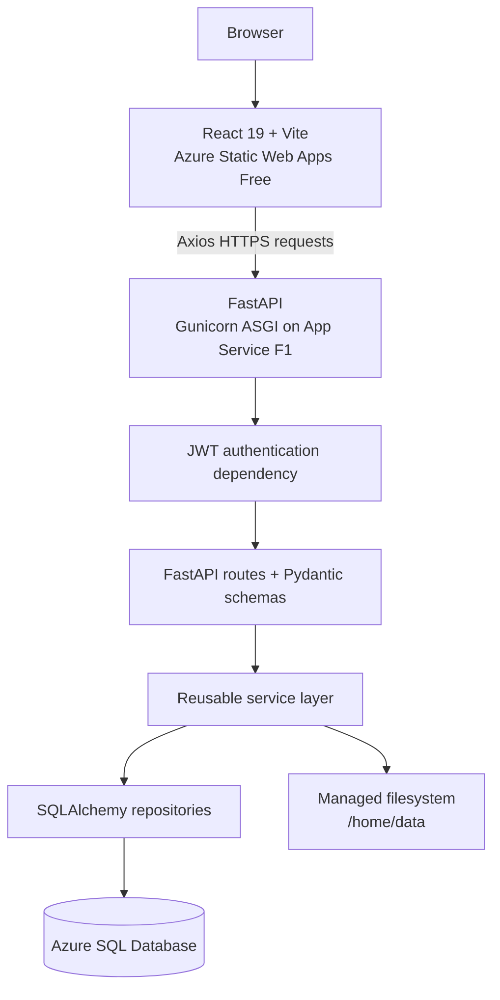
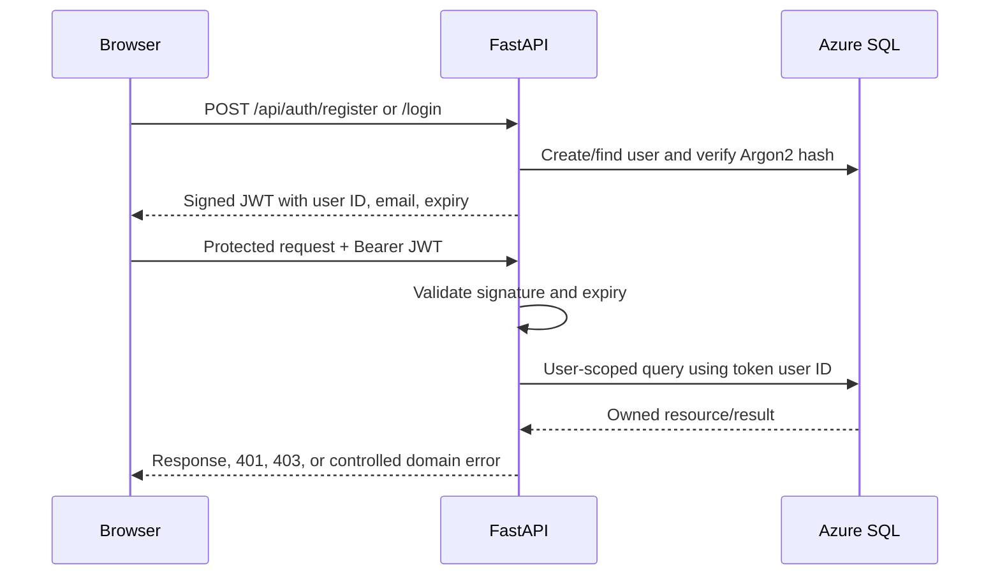

# Architecture and Security

## Runtime Architecture



The React build contains only browser assets. It calls the separately deployed FastAPI API using `VITE_API_BASE_URL`. FastAPI applies exact-origin CORS, validates requests through Pydantic, and delegates workflows to backend services.

## Layer Responsibilities

| Layer | Responsibility |
| --- | --- |
| React pages/components | Forms, events, navigation, conditional states, charts, and downloads |
| API client/auth context | API base URL, bearer token, centralized 401 handling, current user |
| FastAPI routes | HTTP contracts, dependencies, response models, and status codes |
| Services | Uploads, organization, analysis, cleaning, conversion, charts, reports, and storage coordination |
| Repositories | User-scoped SQLAlchemy queries and metadata persistence |
| Azure SQL | Users, files, analysis jobs, reports, logs, settings, and Alembic revision |
| Managed filesystem | Uploaded, processed, cleaned, converted, and report files |

Routes must not copy service logic. React and legacy Streamlit both call the service layer rather than reading the database or filesystem directly.

## Authentication Flow



Registration accepts email and password only. Passwords are never stored directly. The browser stores the JWT in local storage and Axios attaches it to protected requests. A centralized response interceptor removes an expired/invalid token after a `401`.

## Ownership Authorization

`files.user_id` is the ownership root. Analysis jobs and reports reference a file and inherit ownership through that relationship.

```text
users
  `-- files.user_id
        |-- analysis_jobs.file_id
        `-- reports.file_id
```

Every file/dashboard/analysis/cleaning/report/XLSX route requires the authenticated user. Services receive `current_user.id`; repositories either filter by that ID or compare it before returning a direct resource. Outcomes are deliberately distinct:

- `401 Unauthorized`: missing, invalid, or expired bearer token.
- `403 Forbidden`: the resource exists but belongs to another user.
- `404 Not Found`: the requested database resource does not exist.
- `409 Stored File Unavailable`: metadata exists but its physical file cannot be used; re-upload is required.

Automation logs and non-secret settings are system-wide records and are not modeled as user-owned resources.

## Storage Safety

All physical paths are resolved below `DATA_ROOT`. Local development uses `./data`; Azure uses `/home/data`.

- Uploads receive generated safe names.
- Organization moves files into controlled dated directories.
- Downloads, analysis, conversion, and reports require an existing managed file.
- File deletion stages managed files in `.trash`, commits database deletion, and then finalizes storage deletion.
- A failed database transaction restores staged files.
- An obsolete record whose stored path is missing or outside the current root may be deleted from the database, but the external path is never touched.

Azure SQL stores metadata only; it does not store uploaded bytes.

## Deployment Architecture

| Resource | Role |
| --- | --- |
| `smart-workspace-manager-frontend` | Azure Static Web Apps Free React host |
| `smart-workspace-manager-phase1` | Repurposed Linux App Service F1 FastAPI host |
| `smart-workspace-manager-server` | Azure SQL logical server |
| `smart-workspace-manager-db` | Azure SQL metadata database |
| `rg-smart-workspace-manager` | Resource group |

Both deployments are produced from `main`. Backend deployment follows successful pytest checks; frontend deployment follows successful npm install, lint, configuration validation, and production build.

## Security Boundaries

- Secrets are excluded from Git and supplied by Azure/GitHub configuration.
- SQL values are parameterized through SQLAlchemy.
- CORS accepts only configured local and deployed frontend origins.
- Upload extension/size, CSV size/shape, chart rows/categories, and report chart count are bounded.
- API errors avoid returning stack traces or filesystem paths.
- Azure SQL requires encrypted ODBC connections and server firewall authorization.

This is a demonstration architecture, not a production multi-tenant platform. Email verification, MFA, rate limiting, refresh tokens, Blob Storage, and distributed workers are outside its scope.
